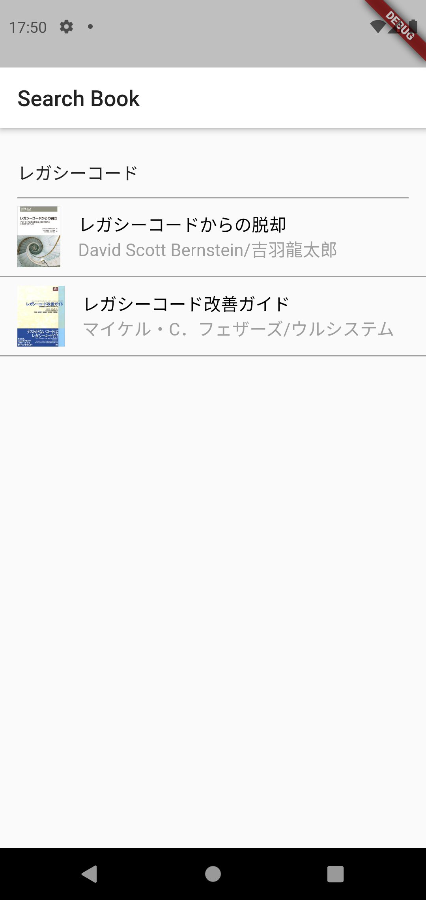
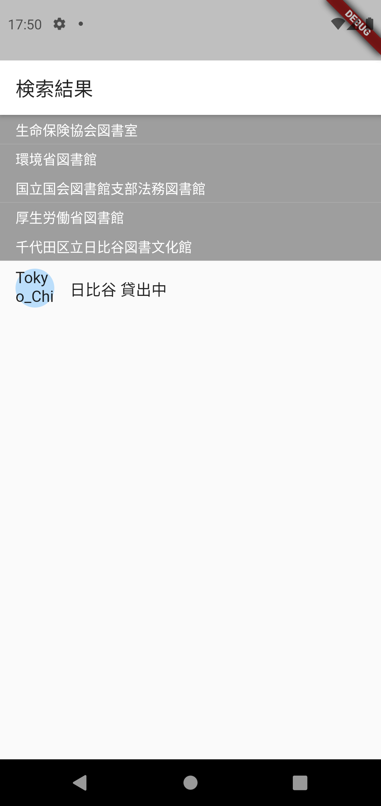

# lib_search_app

近くの図書館に目的の書籍が存在するか調べることができるアプリ

## 使用API
* [楽天ブックス書籍検索API](https://webservice.rakuten.co.jp/api/booksbooksearch/)
* [カーリル図書館API](https://calil.jp/doc/api_ref.html)

## Screen Shots

|Android|iOS|
|:-----:|:-:|
|||
|||
|||